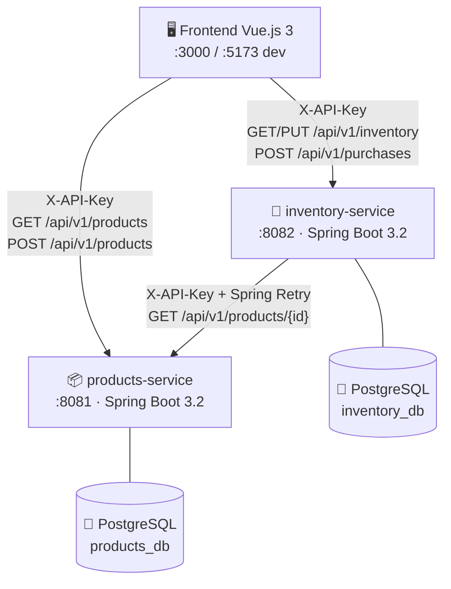
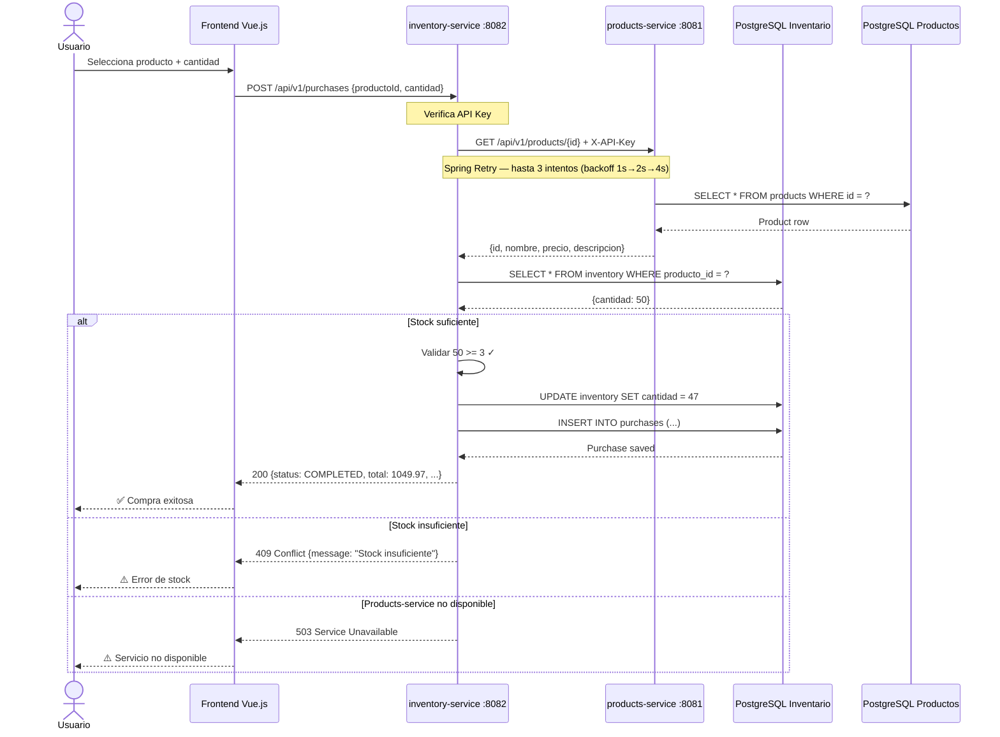
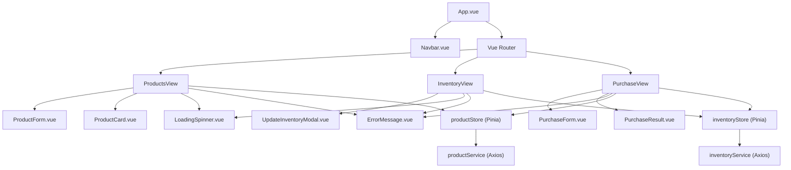

# Linktic Full Stack — Microservicios Java + Vue.js

Solución Full Stack compuesta por dos microservicios independientes en Java Spring Boot y una aplicación Frontend en Vue.js 3, desarrollada como prueba técnica para Linktic.

---

## Tabla de Contenidos

1. [Arquitectura](#arquitectura)
2. [Tecnologías](#tecnologías)
3. [Decisiones Técnicas](#decisiones-técnicas)
4. [Estructura del Proyecto](#estructura-del-proyecto)
5. [Requisitos](#requisitos)
6. [Ejecución con Docker](#ejecución-con-docker)
7. [Ejecución en Desarrollo](#ejecución-en-desarrollo)
8. [APIs y Documentación](#apis-y-documentación)
9. [Testing](#testing)
10. [Git Flow](#git-flow)
11. [Uso de IA](#uso-de-ia)

---

## Arquitectura



---

## Flujo de Compra



---

## Diagrama de Componentes Frontend



---

## Tecnologías

| Capa | Tecnología | Versión |
|------|-----------|---------|
| Backend | Java | 17 |
| Backend | Spring Boot | 3.2.5 |
| Backend | Spring Data JPA | 3.2.5 |
| Backend | Spring Security | 3.2.5 |
| Backend | Spring Retry | 2.x |
| Backend | PostgreSQL | 15 |
| Backend | Springdoc OpenAPI | 2.5.0 |
| Backend | Lombok | 1.18.x |
| Frontend | Vue.js | 3.4 |
| Frontend | Pinia | 2.1 |
| Frontend | Vue Router | 4.3 |
| Frontend | Axios | 1.7 |
| Frontend | Vite | 5.x |
| Testing Backend | JUnit 5 + Mockito | — |
| Testing Frontend | Vitest + Vue Test Utils | 1.6 |
| Infra | Docker + Docker Compose | — |

---

## Decisiones Técnicas

### Base de Datos: PostgreSQL (Relacional)

**Justificación:**
- El modelo de datos es claramente relacional: `producto_id` es referencia cruzada entre servicios.
- El flujo de compra requiere **transacciones ACID**: decrementar inventario y registrar Purchase deben ser atómicos.
- El esquema es estable y bien definido; NoSQL añadiría complejidad sin beneficio real.
- Patrón **Database per Service**: cada microservicio tiene su propia instancia PostgreSQL, garantizando independencia total.

### Flujo de Compra en `inventory-service`

El endpoint `POST /api/v1/purchases` reside en **inventory-service** porque:

1. **Atomicidad**: validar stock y decrementarlo ocurre en la misma transacción JPA — sin condiciones de carrera.
2. **Ownership de datos**: inventory-service es el _source of truth_ del stock.
3. **Baja latencia**: la validación accede directamente a su DB local.
4. El products-service solo se consulta para validar existencia y obtener precio (dato de solo lectura).

### Comunicación entre Servicios

- **Protocolo**: HTTP REST con `RestTemplate` (síncrono, adecuado para carga transaccional).
- **Autenticación**: Header `X-API-Key` en todas las llamadas inter-servicio.
- **Resiliencia**: Spring Retry — 3 intentos, backoff exponencial 1s → 2s → 4s.
- **Timeouts**: configurable via `PRODUCTS_SERVICE_TIMEOUT` (default 5s), implementado en `SimpleClientHttpRequestFactory`.
- **Error handling**: si products-service no responde tras 3 reintentos → 503 con mensaje descriptivo.

### Seguridad: API Key Filter

- `ApiKeyFilter` (extiende `OncePerRequestFilter`) aplicado antes de Spring Security.
- Rutas públicas: `/swagger-ui/**`, `/api-docs/**`, `/actuator/**`.
- Todas las rutas `/api/**` requieren `X-API-Key` válida.
- Las claves se configuran exclusivamente via variables de entorno.

---

## Estructura del Proyecto

```
Prueba Tecnica Linktic/
├── products-service/
│   ├── src/main/java/com/linktic/products/
│   │   ├── config/          # SecurityConfig, OpenApiConfig
│   │   ├── controller/      # ProductController
│   │   ├── dto/             # ProductDTO, CreateProductRequest, ApiResponse
│   │   ├── exception/       # ProductNotFoundException, GlobalExceptionHandler
│   │   ├── model/           # Product (entity)
│   │   ├── repository/      # ProductRepository
│   │   ├── security/        # ApiKeyFilter
│   │   └── service/impl/    # ProductServiceImpl
│   ├── src/test/            # Unit + Integration tests
│   ├── Dockerfile
│   └── pom.xml
│
├── inventory-service/
│   ├── src/main/java/com/linktic/inventory/
│   │   ├── client/          # ProductsClient + ProductsClientImpl
│   │   ├── config/          # SecurityConfig, OpenApiConfig, RestTemplateConfig
│   │   ├── controller/      # InventoryController
│   │   ├── dto/             # InventoryDTO, PurchaseRequest, PurchaseResultDTO…
│   │   ├── exception/       # InventoryNotFoundException, InsufficientStockException…
│   │   ├── model/           # Inventory, Purchase (entities)
│   │   ├── repository/      # InventoryRepository, PurchaseRepository
│   │   ├── security/        # ApiKeyFilter
│   │   └── service/impl/    # InventoryServiceImpl
│   ├── src/test/            # Unit + Integration tests
│   ├── Dockerfile
│   └── pom.xml
│
├── frontend/
│   ├── src/
│   │   ├── assets/          # main.css (design tokens + estilos globales)
│   │   ├── components/
│   │   │   ├── layout/      # Navbar
│   │   │   ├── products/    # ProductCard, ProductForm
│   │   │   ├── inventory/   # UpdateInventoryModal
│   │   │   ├── purchase/    # PurchaseForm, PurchaseResult
│   │   │   └── shared/      # LoadingSpinner, ErrorMessage
│   │   ├── router/          # Vue Router (lazy loading)
│   │   ├── services/        # api.js (Axios + interceptors), productService, inventoryService
│   │   ├── stores/          # productStore, inventoryStore (Pinia)
│   │   └── views/           # ProductsView, InventoryView, PurchaseView
│   ├── tests/unit/          # Vitest + Vue Test Utils
│   ├── Dockerfile
│   └── nginx.conf
│
├── docker-compose.yml
├── .env.example
└── README.md
```

---

## Requisitos

- Docker 24+ y Docker Compose v2
- *(Desarrollo local)* Java 17+, Maven 3.9+, Node.js 20+

---

## Ejecución con Docker

```bash
# 1. Clonar el repositorio
git clone git@github.com:IngenieroRicardoGordillo/prueban-tecnica-hawy-gordillo.git
cd prueban-tecnica-hawy-gordillo

# 2. Configurar variables de entorno
cp .env.example .env
# Opcional: editar .env con tus API keys personalizadas

# 3. Levantar todos los servicios
docker compose up --build

# Servicios disponibles:
# Frontend:           http://localhost:3000
# Products Service:   http://localhost:8081
# Inventory Service:  http://localhost:8082
# Swagger Products:   http://localhost:8081/swagger-ui.html
# Swagger Inventory:  http://localhost:8082/swagger-ui.html

# Detener
docker compose down

# Detener y eliminar volúmenes
docker compose down -v
```

---

## Ejecución en Desarrollo

### Products Service

```bash
cd products-service
export PRODUCTS_DB_URL=jdbc:postgresql://localhost:5432/products_db
export PRODUCTS_DB_USER=postgres
export PRODUCTS_DB_PASSWORD=postgres
export PRODUCTS_API_KEY=dev-products-key
mvn spring-boot:run
# → http://localhost:8081
```

### Inventory Service

```bash
cd inventory-service
export INVENTORY_DB_URL=jdbc:postgresql://localhost:5433/inventory_db
export INVENTORY_DB_USER=postgres
export INVENTORY_DB_PASSWORD=postgres
export INVENTORY_API_KEY=dev-inventory-key
export PRODUCTS_SERVICE_URL=http://localhost:8081
export PRODUCTS_API_KEY=dev-products-key
mvn spring-boot:run
# → http://localhost:8082
```

### Frontend

```bash
cd frontend
cp .env.example .env
npm install
npm run dev
# → http://localhost:5173
```

---

## APIs y Documentación

Swagger UI disponible en cada servicio (sin API Key requerida para acceder a la UI):

| Servicio | Swagger UI |
|----------|-----------|
| Products | http://localhost:8081/swagger-ui.html |
| Inventory | http://localhost:8082/swagger-ui.html |

### Products Service

**Header requerido:** `X-API-Key: <PRODUCTS_API_KEY>`

| Método | Ruta | Descripción | Códigos |
|--------|------|-------------|---------|
| `POST` | `/api/v1/products` | Crear producto | 201, 400, 401 |
| `GET` | `/api/v1/products` | Listar todos | 200, 401 |
| `GET` | `/api/v1/products/{id}` | Obtener por ID | 200, 401, 404 |

**Ejemplo — Crear producto:**
```json
POST /api/v1/products
Headers: X-API-Key: products-api-key-change-in-production

{
  "nombre": "Laptop Dell XPS 15",
  "precio": 2499.99,
  "descripcion": "Laptop de alto rendimiento con i9"
}
```

### Inventory Service

**Header requerido:** `X-API-Key: <INVENTORY_API_KEY>`

| Método | Ruta | Descripción | Códigos |
|--------|------|-------------|---------|
| `GET` | `/api/v1/inventory` | Listar todo el inventario | 200, 401 |
| `GET` | `/api/v1/inventory/{productoId}` | Consultar por producto | 200, 401, 404 |
| `PUT` | `/api/v1/inventory/{productoId}` | Crear/actualizar cantidad | 200, 400, 401 |
| `POST` | `/api/v1/purchases` | Realizar compra | 200, 400, 401, 404, 409, 503 |

**Ejemplo — Realizar compra:**
```json
POST /api/v1/purchases
Headers: X-API-Key: inventory-api-key-change-in-production

{
  "productoId": "550e8400-e29b-41d4-a716-446655440000",
  "cantidad": 2
}
```

### Formato de Respuesta (envelope)

```json
{
  "success": true,
  "data": { "..." },
  "message": "Operación exitosa",
  "timestamp": "2026-06-19T10:30:00"
}
```

Error:
```json
{
  "success": false,
  "message": "Stock insuficiente. Solicitado: 100, Disponible: 47",
  "timestamp": "2026-06-19T10:30:00"
}
```

---

## Testing

### Backend

```bash
cd products-service && mvn test
cd inventory-service && mvn test
```

Tests usan H2 in-memory — no requieren PostgreSQL local.

| Suite | Tipo | Tests |
|-------|------|-------|
| `ProductServiceTest` | Unitario (Mockito) | 5 |
| `ProductControllerIntegrationTest` | Integración (MockMvc + H2) | 5 |
| `InventoryServiceTest` | Unitario (Mockito) | 6 |
| `InventoryControllerIntegrationTest` | Integración (MockMvc + H2 + MockBean) | 5 |

### Frontend

```bash
cd frontend
npm install
npm test              # una pasada
npm run test:watch    # modo watch
npm run test:coverage # con cobertura
```

| Suite | Tests |
|-------|-------|
| `productService.test.js` | 5 |
| `inventoryService.test.js` | 5 |
| `ProductForm.test.js` | 6 |
| `PurchaseForm.test.js` | 7 |

---

## Git Flow

Este proyecto sigue el modelo **Git Flow**:

```
main          ←──── release/1.0.0 ←──── develop
                                          ↑
                          ┌───────────────┼───────────────┐
                    feature/          feature/         feature/
                 products-service  inventory-service  frontend-vue  ...
```

| Rama | Propósito |
|------|-----------|
| `main` | Código en producción, siempre estable. Tagged con versión. |
| `develop` | Integración de features. Base para nuevas ramas. |
| `feature/products-service` | Microservicio de productos |
| `feature/inventory-service` | Microservicio de inventario |
| `feature/frontend-vue` | Aplicación Vue.js 3 |
| `feature/docker-devops` | Docker Compose e infraestructura |
| `feature/documentation` | README, diagramas, decisiones técnicas |
| `release/1.0.0` | Preparación de release, merge a `main` con tag `v1.0.0` |

---

## Uso de IA

Este proyecto fue desarrollado con asistencia de **Claude Sonnet 4.6** (Anthropic) a través de la herramienta **Claude Code**.

**Áreas de asistencia:**
- Diseño de la arquitectura de microservicios y decisiones técnicas.
- Generación del scaffolding completo de ambos servicios Spring Boot.
- Implementación de patrones: `ApiKeyFilter`, Spring Retry con backoff exponencial, `GlobalExceptionHandler`.
- Estructura del frontend Vue.js con Composition API, Pinia stores y servicios Axios.
- Escritura de tests unitarios y de integración (backend y frontend).
- Configuración de Docker Compose con health checks, redes aisladas y volúmenes persistentes.
- Diagramas Mermaid de arquitectura, flujo de compra y componentes.
- Implementación de Git Flow y estructura de ramas.

**Revisión humana:** Todo el código generado fue revisado para garantizar coherencia, buenas prácticas y corrección funcional.
